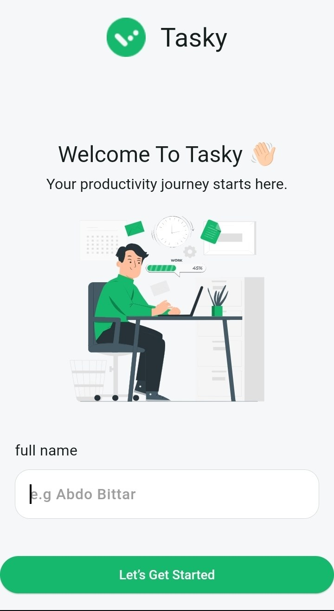
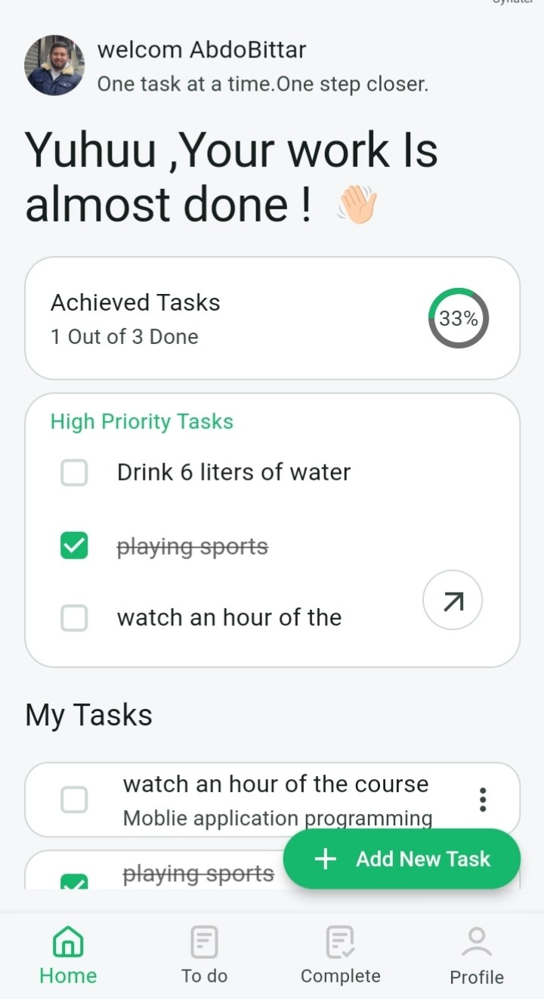
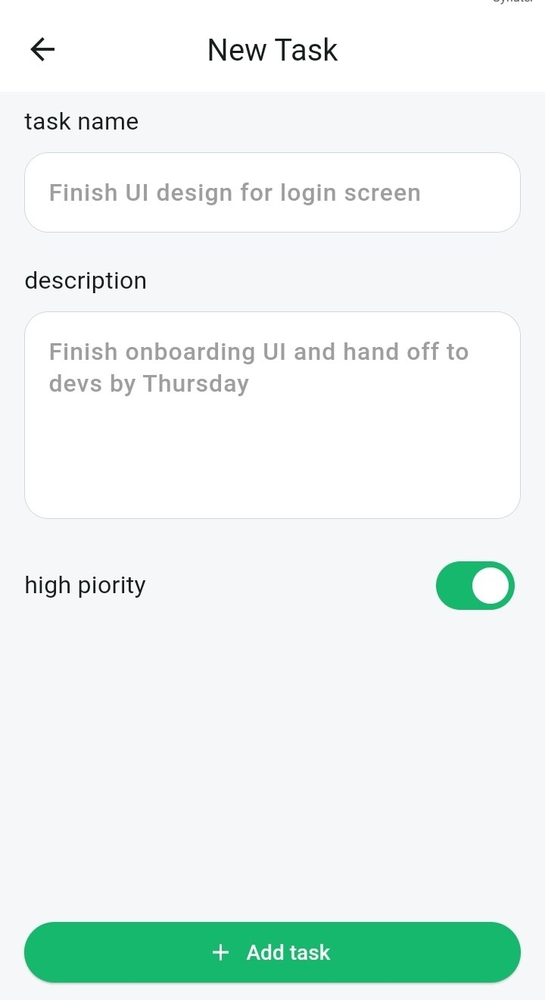
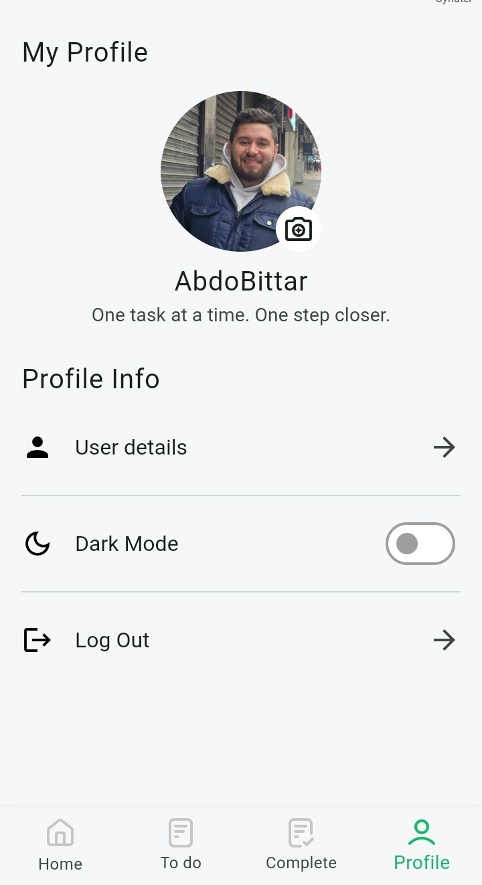

# Tasky

A clean and intuitive Flutter task management application designed to help users organize their daily activities efficiently.

Tasky is built using Flutter and follows Clean Architecture principles to provide a maintainable and scalable codebase. The application focuses on productivity by allowing users to create, organize, and manage their daily tasks with a clean and user-friendly interface.

---

## Features

- Create new tasks.
- Edit existing tasks.
- Delete tasks.
- Mark tasks as completed.
- Local data persistence using SharedPreferences.
- Store user information and images locally.
- Clean and reusable UI components.
- Dark & Light theme support.
- Responsive interface.
- Built following Clean Architecture principles.

---

## Screenshots

| Intro | Home |
|-------|------|
|  |  |

| Add Task | Profile |
|----------|---------|
|  |  |

---

## Tech Stack

- Flutter
- Dart
- SharedPreferences
- Clean Architecture
- Git & GitHub
- Figma

---

## Architecture

The application follows **Clean Architecture** to separate business logic from the presentation layer, making the project easier to maintain and extend.

```
Presentation
     │
     ▼
   Domain
     │
     ▼
     Data
```

---

## Getting Started

```bash
git clone https://github.com/abdobittar99/tasky.git

cd tasky

flutter pub get

flutter run
```

---

## Project Structure

```
lib/
├── core/
├── modules/
├── shared/
└── main.dart
```

---

## Author

**Abdalrahman Bittar**

- GitHub: https://github.com/abdobittar99
- Email: abdo.bittar79@gmail.com
