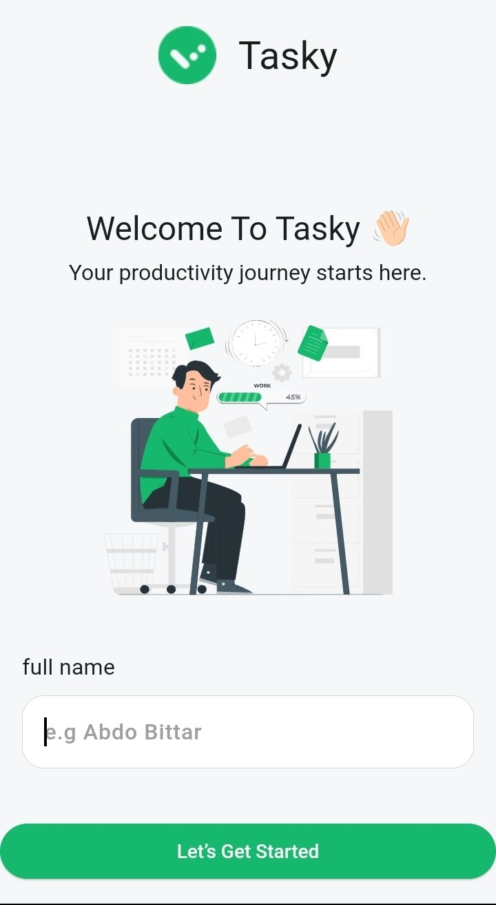
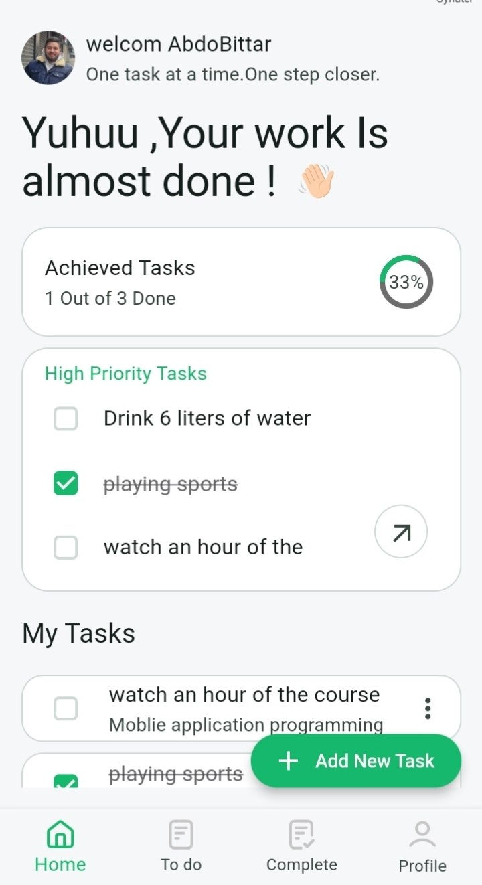
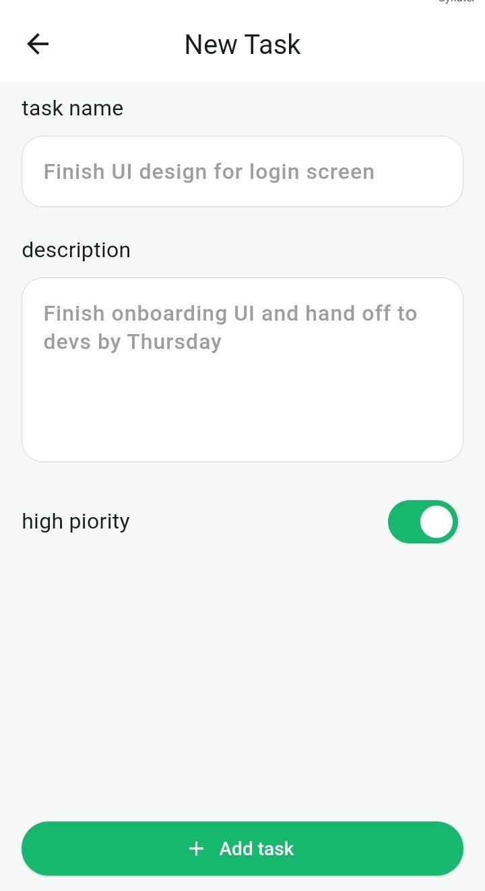
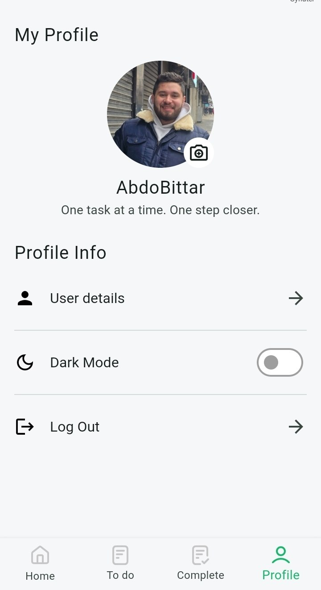

# Tasky

A clean and intuitive cross-platform Flutter task management application designed to help users organize their daily activities, prioritize tasks, and improve productivity.

Tasky is built using Flutter and follows Clean Architecture principles to provide a maintainable and well-organized codebase. The application includes responsive UI design, local data persistence, state management with Provider, and local file and image storage.

---

## Features

- Create new tasks.
- Edit existing tasks.
- Delete tasks.
- Mark tasks as completed.
- Prioritize and organize daily tasks.
- Responsive UI for different mobile screen sizes.
- State management using Provider.
- Local data persistence using Hive and SharedPreferences.
- Local file and image storage using Path Provider.
- Store user information and images locally.
- Clean and reusable UI components.
- Dark & Light theme support.
- Built following Clean Architecture principles.

---

## Screenshots

| Intro | Home |
|-------|------|
|  |  |

| Add Task | Profile |
|----------|---------|
|  |  |

---

## Tech Stack

- Flutter
- Dart
- Provider
- Hive
- SharedPreferences
- Path Provider
- Clean Architecture
- Git & GitHub
- Figma

---

## Architecture

The application follows **Clean Architecture** to separate business logic from the presentation layer, making the project easier to maintain and extend.

```text
Presentation
     │
     ▼
   Domain
     │
     ▼
    Data
```

---


## State Management

Tasky uses Provider for state management, providing a simple and organized approach to managing application state and updating the UI based on state changes.

## Local Storage

The application uses multiple local storage solutions based on the type of data being stored:

-Hive – Local storage for application data.
-SharedPreferences – Storing user information and application preferences.
-Path Provider – Accessing local application directories for file and image storage.

## Responsive Design

The application is designed to adapt to different mobile screen sizes, providing a consistent and usable interface across various devices.


## Getting Started

```bash
git clone https://github.com/abdobittar99/tasky.git

cd tasky

flutter pub get

flutter run
```

---

## Project Structure

```
lib/
├── core/
├── features/
├── models/
└── main.dart
```

---

## Author

**Abdalrahman Bittar**

- GitHub: https://github.com/abdobittar99
- Email: abdo.bittar79@gmail.com
